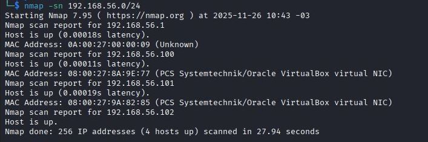
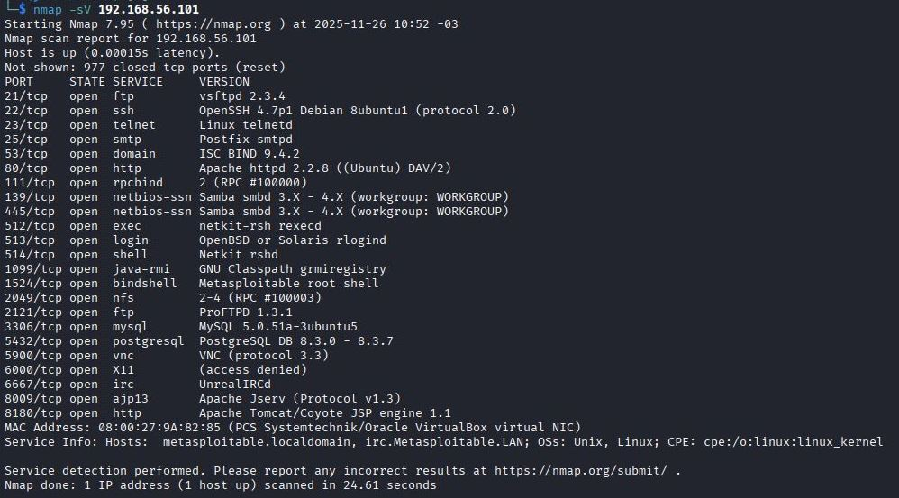
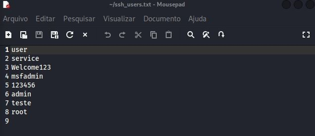
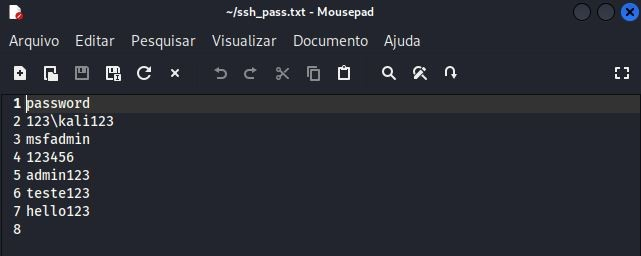
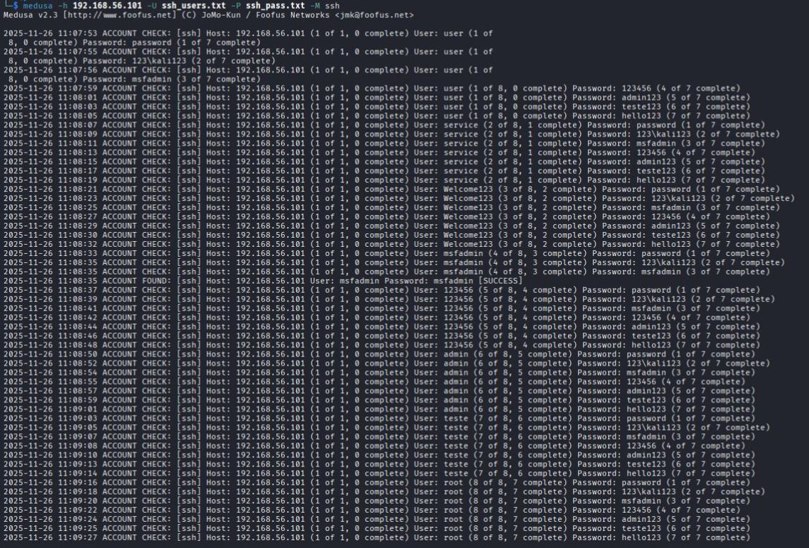
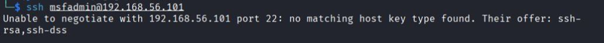
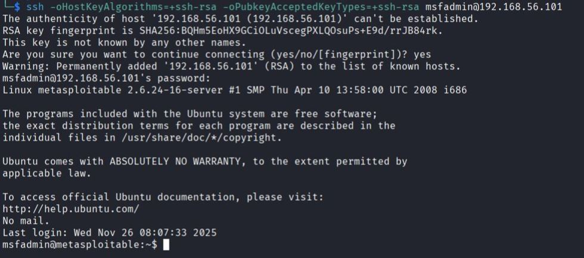

<h1>Projeto: Teste de Força Bruta em SSH com Kali Linux + Medusa</h1>

Este projeto faz parte do desafio da DIO e demonstra um ataque de força bruta utilizando a ferramenta Medusa no Kali Linux, direcionado ao serviço SSH da máquina vulnerável Metasploitable 2.
O objetivo é compreender vulnerabilidades de autenticação, explorar serviços inseguros e documentar o processo de forma prática e estruturada.

<h3>Arquitetura do Ambiente</h3>
<ul>
  <li>Kali Linux — máquina atacante</li>
  <li>Metasploitable 2 — máquina alvo</li>
  <li>Rede configurada em Host-Only</li> 
  <li>IP do alvo: 192.168.56.101</li>
</ul>
<br>


<br>

<br>
<h3>Ferramentas Utilizadas</h3>
<ul>
  <li>Kali Linux</li>
  <li>Medusa</li>
  <li>Metasploitable 2</li>
</ul>


<br><br>
<ol>
  <h2><li>Descobrindo dispositivos ativos na rede</li></h2>
  Para identificar quais máquinas estavam ativas na rede interna (Host-Only), utilizei o comando:<br>
  <br>
  
  ```
 nmap -sn 192.168.56.0/24
 ```
  Com isso Identificamos o IP alvo:
  
   
   
   <h2><li>Identificando portas abertas</li></h2>
   Após localizar o alvo, realizei um scan de serviços e versões utilizando:<br>
  <br>
  
  ```
  nmap -sV 192.168.56.101
  ```
  Com isso identificamos as portas abertas:
  
  

  <h2><li>Criação das wordlists de usuários e senhas</li></h2>
  Para realizar o ataque de força bruta no serviço SSH, criei duas wordlists simples: Uma contendo possíveis usuários e outra com possíveis senhas.
  <br>
  <h4>Wordlist de usuários</h4>
  Criei o arquivo ssh_users.txt contendo nomes de usuários comuns em ambientes Linux e também os que já sabia que existem no Metasploitable, com o comando:
  <br><br>

  ```
  echo -e 'user\nservice\nWelcome123\nmsfadmin\n123456\nadmin\nteste\nroot'> ssh_users.txt
  ```
  
   <br>
  <h4>Wordlist de senhas</h4>
  Em seguida, criei o arquivo ssh_pass.txt com senhas fracas e frequentemente utilizadas em sistemas vulneráveis:, com o comando:
  <br><br>

  ```
  echo -e 'password\n123\kali123\nmsfadmin\n123456\nadmin123\nteste123\nhello123' > ssh_pass.txt
  ```
  

  <h2><li>Ataque de força bruta</li></h2>
  Com as wordlists de usuários e senhas criadas, realizei um ataque de força bruta contra o serviço SSH da máquina Metasploitable. O comando utilizado foi:
  <br><br>
  
   ```
  medusa -h 192.168.56.101 -U ssh_users.txt -P ssh_pass.txt -M ssh
  ```

  <h4>Resultado do ataque</h4>
  Após executar o ataque de força bruta, foi possível identificar uma combinação válida de usuário e senha para acessar o serviço SSH da máquina Metasploitable.
  <br><br>
  
  

  Combinação encontrada:

  ```
  Usuário: msfadmin
  Senha: msfadmin
  ```

  <h2><li>Acessando o SSH com as credenciais encontradas</li></h2>
  Com as credenciais identificadas pelo Medusa, tentei acessar a máquina Metasploitable através do SSH utilizando o comando:
  <br><br>

  ```
  ssh msfadmin@192.168.56.101
  ```
  <h4>Problema encontrado durante o acesso</h4>
  Ao tentar conectar, o SSH retornou o seguinte erro:
  <br><br>
  
  
  
  Esse erro ocorre porque:
  <ul>
  <li>O Metasploitable 2 usa uma versão extremamente antiga do SSH (OpenSSH 4.7)</li>
  <li>Essa versão só oferece algoritmos de chave fracos: ssh-rsa e ssh-dss</li>
  <li>O Kali Linux atual removeu suporte a esses algoritmos por padrão, por motivos de segurança</li>
  </ul>
  <br>
  <h4>Solução: habilitar temporariamente o algoritmo antigo</h4>
  Para conseguir acessar, foi necessário permitir explicitamente o uso do algoritmo ssh-rsa:

  ```
  ssh -oHostKeyAlgorithms=+ssh-rsa -oPubkeyAcceptedKeyTypes=+ssh-rsa msfadmin@192.168.56.101
  ```
  <br>
  Após isso, o acesso foi estabelecido normalmente:
  <br><br>

  
  
  <h2><li>Conclusão</li></h2>
  Este projeto demonstrou, na prática o uso de ferramentas em um ambiente controlado com Kali Linux e uma máquina vulnerável. Foi possível configurar corretamente as duas VMs, identificar o serviço SSH ativo na Metasploitable, criar wordlists simples e, executar um ataque de força bruta para verificar a segurança do serviço.
  <br><br>
  Ao longo do processo foi possível:
  <br><br>
  <ul>
    <li>Identificar o dispositivo alvo na rede interna;</li>
    <li>Enumerar portas abertas e detectar o serviço SSH ativo;</li>
    <li>Criar wordlists personalizadas de usuários e senhas;</li>
    <li>Realizar um ataque de força bruta utilizando o Medusa;</li>
    <li>Encontrar credenciais válidas (msfadmin : msfadmin);</li>
    <li>Tentar acessar o serviço SSH e identificar um erro de compatibilidade criptográfica;</li>
    <li>Corrigir o erro forçando o uso de algoritmos antigos (ssh-rsa);</li>
    <li>Obter acesso completo à máquina Metasploitable.</li>
  </ul>

</ol>
