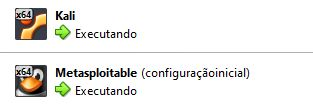
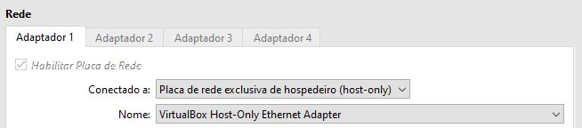

<h1>Projeto: Teste de Força Bruta em SSH com Kali Linux + Medusa</h1>

Este projeto faz parte do desafio da DIO e demonstra um ataque de força bruta utilizando a ferramenta Medusa no Kali Linux, direcionado ao serviço SSH da máquina vulnerável Metasploitable 2.
O objetivo é compreender vulnerabilidades de autenticação, explorar serviços inseguros e documentar o processo de forma prática e estruturada.

<h3>Arquitetura do Ambiente</h3>
<ul>
  <li>Kali Linux — máquina atacante</li>
  <li>Metasploitable 2 — máquina alvo</li>
  <li>Rede configurada em Host-Only</li> 
  <li>IP do alvo: 192.168.56.101</li>
</ul>
<br>


<br>

<br>
<h3>Ferramentas Utilizadas</h3>
<ul>
  <li>Kali Linux</li>
  <li>Medusa</li>
  <li>Metasploitable 2</li>
</ul>


<br>
<ol>
  <h3><li>Descobrindo dispositivos ativos na rede</li></h3>
  Para identificar quais máquinas estavam ativas na rede interna (Host-Only), utilizei o comando:<br>
  <br>
  
  ```
 nmap -sn 192.168.56.0/24
 ```
  
</ol>
